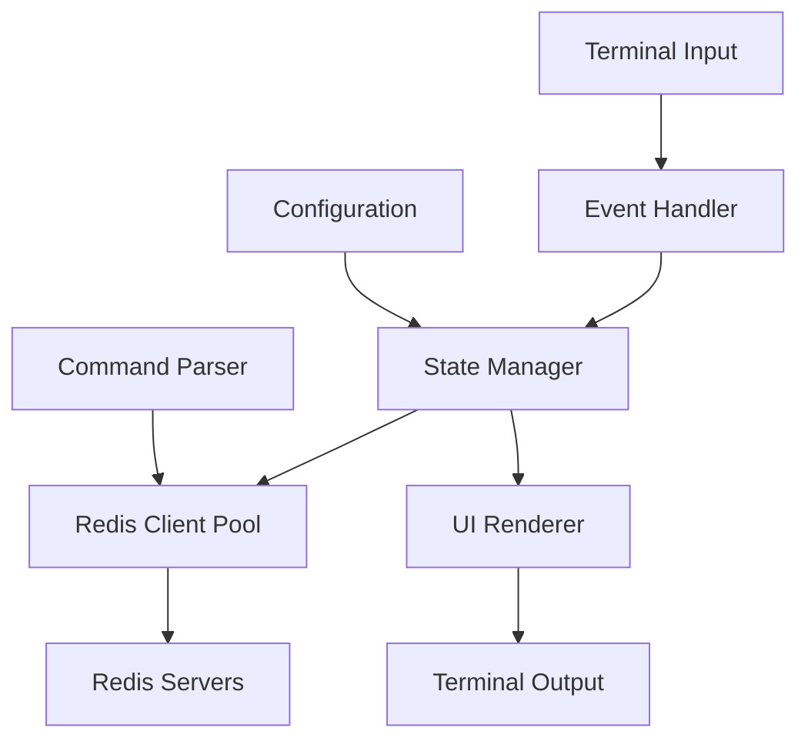

# RUDIS - Redis TUI Client Development Plan

## Project Overview

**RUDIS** (Redis TUI) is a terminal-based Redis client application built with Ratatui, aiming to provide functionality similar to Another Redis Desktop Manager but in a lightweight, terminal-native interface.

### Target Features
- Multi-Redis server connection management
- Real-time database browsing and key exploration
- Redis command execution with syntax highlighting
- Data visualization and editing capabilities
- Performance monitoring and statistics
- Configuration management

## Architecture Design

### 1. Core Architecture

The application will follow an **event-driven architecture** with the following key principles:
- **State Management**: Centralized application state using the `App` struct
- **Event Loop**: Non-blocking event processing with crossterm
- **Modular UI**: Component-based UI system with Ratatui widgets
- **Async Operations**: Non-blocking Redis operations using tokio



### 2. Module Structure

```
src/
├── main.rs                 # Application entry point
├── app/
│   ├── mod.rs             # App state management
│   ├── state.rs           # Application state definitions
│   └── config.rs          # Configuration management
├── ui/
│   ├── mod.rs             # UI module exports
│   ├── layout.rs          # Layout management
│   ├── components/        # Reusable UI components
│   │   ├── mod.rs
│   │   ├── connection_list.rs
│   │   ├── database_browser.rs
│   │   ├── key_viewer.rs
│   │   ├── command_input.rs
│   │   └── status_bar.rs
│   └── themes.rs          # Color themes and styling
├── redis/
│   ├── mod.rs             # Redis module exports
│   ├── client.rs          # Redis client wrapper
│   ├── connection.rs      # Connection management
│   ├── commands.rs        # Redis command implementations
│   └── types.rs           # Redis data type handlers
├── events/
│   ├── mod.rs             # Event system
│   ├── handler.rs         # Event processing
│   └── types.rs           # Event type definitions
├── utils/
│   ├── mod.rs
│   ├── formatter.rs       # Data formatting utilities
│   └── parser.rs          # Command parsing
└── error.rs               # Error handling
```

## Development Phases

### Phase 1: Foundation & Basic Connection (Week 1-2)

#### 1.1 Project Setup
- [ ] Add Redis dependencies to Cargo.toml
- [ ] Set up async runtime (tokio)
- [ ] Configure logging system
- [ ] Create basic error handling framework

**Dependencies to Add:**
```toml
[dependencies]
tokio = { version = "1.0", features = ["full"] }
redis = { version = "0.24", features = ["tokio-comp"] }
serde = { version = "1.0", features = ["derive"] }
serde_json = "1.0"
toml = "0.8"
log = "0.4"
env_logger = "0.10"
futures = "0.3"
```

#### 1.2 Core Application Structure
- [ ] Expand `App` struct with Redis connection state
- [ ] Implement configuration loading/saving
- [ ] Create basic UI layout with panels
- [ ] Add connection management system

#### 1.3 Basic Redis Connection
- [ ] Implement Redis connection wrapper
- [ ] Add connection status indicators
- [ ] Create connection configuration UI
- [ ] Test basic Redis commands (PING, INFO)

### Phase 2: Database Navigation (Week 3-4)

#### 2.1 Database Browser
- [ ] Implement database listing
- [ ] Create key scanning with pagination
- [ ] Add key type detection and icons
- [ ] Implement search and filtering

#### 2.2 Key Management
- [ ] Key selection and navigation
- [ ] Key information display (TTL, type, size)
- [ ] Basic key operations (DEL, RENAME, EXPIRE)
- [ ] Key pattern matching

#### 2.3 UI Components
- [ ] Scrollable key list component
- [ ] Tree view for nested keys
- [ ] Status bar with connection info
- [ ] Help panel with keyboard shortcuts

### Phase 3: Data Viewing & Editing (Week 5-6)

#### 3.1 Data Type Support
- [ ] String value viewer/editor
- [ ] Hash field browser and editor
- [ ] List element viewer with pagination
- [ ] Set member browser
- [ ] Sorted set viewer with scores
- [ ] Stream message viewer

#### 3.2 Data Operations
- [ ] Value editing with validation
- [ ] JSON syntax highlighting
- [ ] Binary data handling
- [ ] Data export/import functionality

#### 3.3 Advanced Features
- [ ] Multi-key operations
- [ ] Bulk operations with progress bars
- [ ] Data type conversion utilities
- [ ] Value comparison tools

### Phase 4: Command Interface & Monitoring (Week 7-8)

#### 4.1 Command Execution
- [ ] Redis CLI-like command input
- [ ] Command history and autocomplete
- [ ] Syntax highlighting for Redis commands
- [ ] Result formatting and display

#### 4.2 Monitoring Features
- [ ] Real-time key space monitoring
- [ ] Memory usage statistics
- [ ] Command statistics display
- [ ] Slow log viewer

#### 4.3 Performance Optimization
- [ ] Lazy loading for large datasets
- [ ] Connection pooling
- [ ] Background data refreshing
- [ ] Memory-efficient key scanning

### Phase 5: Advanced Features & Polish (Week 9-10)

#### 5.1 Multi-Server Management
- [ ] Multiple connection tabs
- [ ] Connection groups/folders
- [ ] Server comparison tools
- [ ] Cross-server data migration

#### 5.2 User Experience
- [ ] Customizable themes and colors
- [ ] Configurable keyboard shortcuts
- [ ] Context-sensitive help
- [ ] Error recovery and retry mechanisms

#### 5.3 Configuration & Persistence
- [ ] Configuration file management
- [ ] Connection profiles
- [ ] UI state persistence
- [ ] Session management

## Technical Implementation Details

### 1. State Management

```rust
pub struct App {
    // Core application state
    pub running: bool,
    pub current_tab: usize,
    
    // Redis connections
    pub connections: Vec<RedisConnection>,
    pub active_connection: Option<usize>,
    
    // UI state
    pub selected_database: Option<u8>,
    pub selected_key: Option<String>,
    pub current_view: ViewMode,
    
    // Configuration
    pub config: AppConfig,
    
    // Event handling
    pub event_rx: mpsc::Receiver<AppEvent>,
}

pub enum ViewMode {
    ConnectionList,
    DatabaseBrowser,
    KeyViewer,
    CommandInterface,
    Settings,
}
```

### 2. Redis Integration

```rust
pub struct RedisConnection {
    pub id: String,
    pub config: ConnectionConfig,
    pub client: redis::Client,
    pub status: ConnectionStatus,
    pub databases: Vec<DatabaseInfo>,
}

pub struct ConnectionConfig {
    pub name: String,
    pub host: String,
    pub port: u16,
    pub auth: Option<String>,
    pub ssl: bool,
}
```

### 3. Event System

```rust
pub enum AppEvent {
    KeyPressed(KeyEvent),
    RedisResponse(RedisResult),
    ConnectionStatusChanged(usize, ConnectionStatus),
    DatabaseSelected(u8),
    KeySelected(String),
    RefreshData,
    Quit,
}
```

### 4. UI Layout Strategy

The application will use a flexible panel-based layout:

```
┌─────────────────────────────────────────────────────────────┐
│ RUDIS - Redis TUI Client                               v0.1.0│
├─────────────────────────────────────────────────────────────┤
│ Connections  │ DB[0] Keys (1,234)    │ Key: user:123        │
│ ┌─────────── │ ┌───────────────────  │ ┌─────────────────── │
│ │● local     │ │ 🔤 user:*            │ │ Type: Hash         │
│ │○ prod-1    │ │ 🔤 session:*         │ │ TTL: 3600s         │ 
│ │○ prod-2    │ │ 📋 cache:*           │ │ Size: 245 bytes    │
│ └─────────── │ │ 📊 stats:*           │ ├─────────────────── │
│              │ │ > user:123 ◄         │ │ Fields (3):        │
│              │ │   user:456           │ │ • name: "John"     │
│              │ │   user:789           │ │ • email: "@..."    │
│              │ └───────────────────   │ │ • age: 30          │
│              │                       │ └─────────────────── │
├─────────────────────────────────────────────────────────────┤
│ > redis-cli: GET user:123                        Connected   │
└─────────────────────────────────────────────────────────────┘
```

## Keyboard Shortcuts Design

### Navigation
- `Tab` / `Shift+Tab` - Navigate between panels
- `h/j/k/l` or `Arrow keys` - Navigate within panels
- `Enter` - Select/Open item
- `Esc` - Go back/Cancel
- `q` - Quit application

### Redis Operations
- `c` - Connect to Redis server
- `d` - Disconnect
- `r` - Refresh current view
- `f` - Search/Filter
- `Del` - Delete selected key
- `F2` - Rename key
- `F5` - Set TTL

### Views
- `1-9` - Switch between database tabs
- `Ctrl+T` - New connection tab
- `Ctrl+W` - Close connection tab
- `F1` - Help
- `:` - Open command mode

## Testing Strategy

### Unit Tests
- Redis client wrapper functionality
- Data type parsers and formatters
- Configuration management
- Event handling logic

### Integration Tests
- Redis server interaction
- UI component rendering
- Keyboard input handling
- Error recovery scenarios

### Manual Testing
- Performance with large datasets
- Memory usage monitoring
- UI responsiveness
- Cross-platform compatibility

## Deployment & Distribution

### Build Optimization
- Release builds with optimizations
- Static linking for standalone binaries
- Platform-specific builds (Linux, macOS, Windows)

### Documentation
- User manual with screenshots
- Configuration examples
- Troubleshooting guide
- Development setup instructions

## Success Metrics

### Functionality Goals
- ✅ Connect to multiple Redis servers
- ✅ Browse databases and keys efficiently
- ✅ View and edit all Redis data types
- ✅ Execute Redis commands interactively
- ✅ Monitor Redis performance metrics

### Performance Goals
- Handle databases with 100k+ keys smoothly
- Sub-100ms response time for UI interactions
- Memory usage under 50MB for typical usage
- Startup time under 2 seconds

### User Experience Goals
- Intuitive navigation without documentation
- Consistent keyboard shortcuts
- Helpful error messages and recovery
- Customizable interface preferences

## Risk Assessment & Mitigation

### Technical Risks
1. **Performance with Large Datasets**
   - Mitigation: Implement lazy loading and pagination
   - Fallback: Limit key scanning with warnings

2. **Redis Connection Management**
   - Mitigation: Robust connection pooling and retry logic
   - Fallback: Manual connection recovery options

3. **UI Responsiveness**
   - Mitigation: Async operations with progress indicators
   - Fallback: Background processing with notifications

### Implementation Risks
1. **Complexity Creep**
   - Mitigation: Strict adherence to MVP for each phase
   - Monitor: Regular code review and refactoring

2. **Cross-Platform Compatibility**
   - Mitigation: Early testing on target platforms
   - CI/CD: Automated testing on multiple OS

## Future Enhancements (Post-v1.0)

### Advanced Features
- Redis Cluster support
- Pub/Sub message monitoring
- Redis Modules integration (RedisJSON, RedisGraph)
- Data visualization charts
- Export to various formats (CSV, JSON, XML)
- Scripting support (Lua)

### Enterprise Features  
- User authentication and roles
- Audit logging
- Team collaboration features
- Advanced monitoring and alerting
- Custom dashboard creation

---

This development plan provides a structured approach to building a comprehensive Redis TUI client that rivals desktop applications while maintaining the efficiency and elegance of a terminal interface.